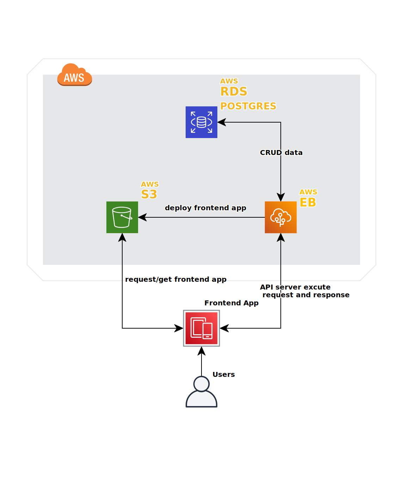

## Infrastructure description

### AWS
#### RDS Postgres
AWS RDS Postgres using for CRUD data.

Database Endpoint: `postgres-duclt7.clnvpbtiyewv.us-east-1.rds.amazonaws.com`

#### S3 Bucket
AWS S3 Bucket will host frontend app as a static web.

Bucket URL: `http://duclt7bucket.s3-website-us-east-1.amazonaws.com`

users can access the web app by the Bucket URL.

#### Elastic Beanstalk
AWS Elastic Beanstalk service will deploy the server and expose an endpoint for frontapp to call API.

EB URL: `http://udagramapi-env.eba-zw9mgcqk.us-east-1.elasticbeanstalk.com/`
