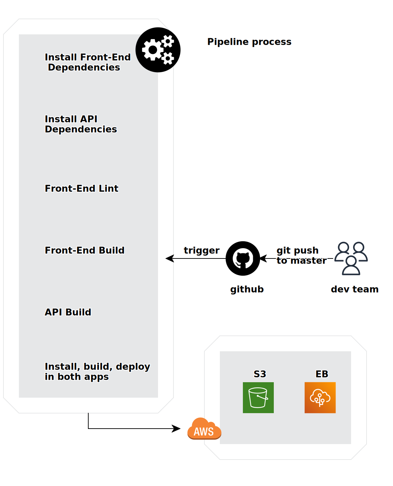

## App Pipeline

### Pipeline process
#### GitHub
the GitHub repository have to be linked with the CircleCI, The develop team commit and push code to the master branch.
and GitHub triggers the CircleCI to run.

#### CircleCI
CircleCI config has been stored in `.circleci/config.yml`.
CircleCI will run pipeline to process:
- Frontend: build and using AWS CLI to upload frontend bundle file to S3.
- Server: build and using Then uses EB CLI to deploy server.
